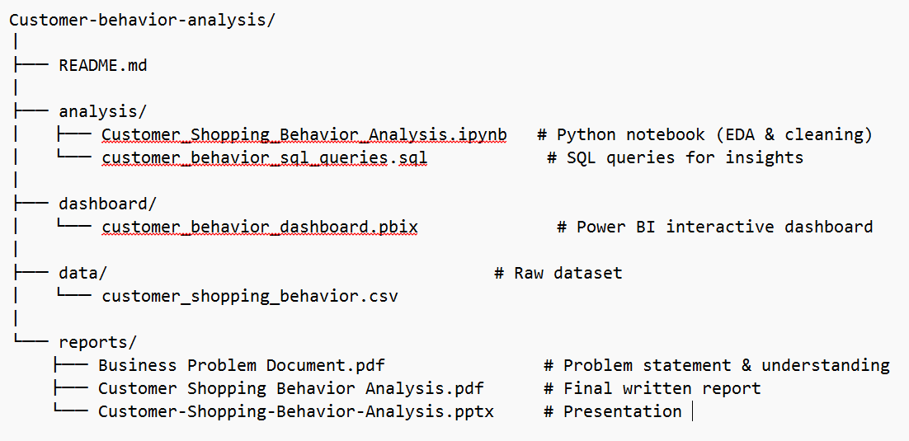

# 👨🏻‍💻 Customer Behavior Data Analysis

*Analyze customer spending patterns, identify trends, and generate actionable insights using Python, SQL, and Power BI.*

---


## Overview
Designed and executed a complete end-to-end data analytics workflow simulating a professional business environment. Leveraged transactional data from **3,900 purchases** across multiple product categories to **analyze customer behavior, identify trends, and generate strategic business insights**. Performed data cleaning in Python, structured analysis in SQL, and visualized key metrics in Power BI.

---

## Business Problem
Addressed challenges faced by organizations in improving sales, loyalty, and customer retention by:  
- **Analyzing** purchasing trends and identifying high-value customer segments  
- **Detecting** loyal customers and repeat buyers  
- **Generating** actionable insights for targeted marketing and business strategy  
- **Evaluating** product performance and discount effectiveness  

---

## Dataset Summary
- **Rows/Purchases:** 3,900  
- **Columns:** 18  
- **Key Features:** Customer demographics, purchase details (Item, Category, Amount), and shopping behavior (Discount Applied, Previous Purchases, Review Rating, Subscription Status)  
- **Missing Data:** Imputed 37 missing values in `Review Rating`  

---

## Tools & Technologies
- **Python (Pandas):** Cleaned, transformed, and engineered features  
- **SQL (PostgreSQL):** Queried structured data and extracted business insights  
- **Power BI:** Built interactive dashboards and KPIs  
- **Jupyter Notebook:** Documented EDA workflow  

---

## 🗂️ Project Structure




---

## Data Cleaning & Preparation
- **Handled missing data:** Imputed `Review Rating` using median per product category  
- **Standardized columns:** Renamed columns to snake_case  
- **Engineered features:** Created `age_group` column for segmentation  
- **Validated data:** Removed redundant columns like `promo_code_used`  
- **Integrated database:** Loaded cleaned data into PostgreSQL for analysis  

---

## Exploratory Data Analysis (EDA)
- **Examined** purchase amount distribution: mean $59.76  
- **Analyzed** gender distribution: majority male customers  
- **Evaluated** review ratings: average rating 3.75  
- **Visualized** purchase patterns and customer segmentation  

---

## Research Questions & Key Findings
- **Revenue by Gender:** Male customers generated $157,890 vs. female $75,191  
- **Subscribers vs. Non-Subscribers:** Non-subscribers generated $170,436 due to volume  
- **Repeat Buyers Conversion:** Identified 2,518 loyal customers not subscribed, highlighting conversion opportunities  
- **High-Value Discount Users:** 839 customers used discounts while spending at/above average amount  
- **Top Products for Marketing:** Gloves, Sandals, Boots received highest ratings; Hats had highest discount usage  
- **Revenue by Age Group:** Young Adults contributed $62,143  

### Business Recommendations
- **Promote subscriptions:** Encourage non-subscribers to convert loyal buyers  
- **Target marketing campaigns:** Focus on Young Adult segment and premium Express Shipping users  
- **Optimize discount policies:** Review high-discount products like Hats for margin control  

---

## Dashboard
- **Developed** interactive Power BI dashboard summarizing key metrics  
- **Visualized** revenue by category, sales by age group, subscription status, and average purchase amount  
- **Tracked KPIs:** 3.9K customers, average review rating 3.75  


---

## Project Links
- 🔗 **GitHub Repository:** [https://github.com/pallavivhalgade/customer-analysis-python-PowerBI.git](https://github.com/pallavivhalgade/customer-analysis-python-PowerBI.git)  
- 📄 **Project Report PDF:** [https://drive.google.com/file/d/1TkWuLTKY4H324EpAdgpdPrcp6e-tUlvu/view?usp=sharing]  
- 💡 **Presentation Deck:** [https://drive.google.com/file/d/1GEbTJxG_ulYjsVqHtPjDNHzEgRI3DdXk/view?usp=sharing]
---

## How to Run This Project
1. **Clone the repository:**
```bash
git clone https://github.com/pallavivhalgade/customer-analysis-python-PowerBI.git
cd customer-analysis-python-PowerBI


2.Open Jupyter Notebook:
Open Customer_Shopping_Behavior_Analysis.ipynb and execute all cells to clean data and load into SQL.

3.Run SQL Queries:
Execute customer_behavior_sql_queries.sql to extract business insights.

4.Explore Dashboard:
Open customer_behavior_dashboard.pbix and connect to SQL database for interactive visualizations.

##Author & Contact


Pallavi Vijay Vhalgade
Final Year AIML Student | Aspiring Data Analyst
📧 Email: pallavivhalgade@gmail.com

🔗 GitHub